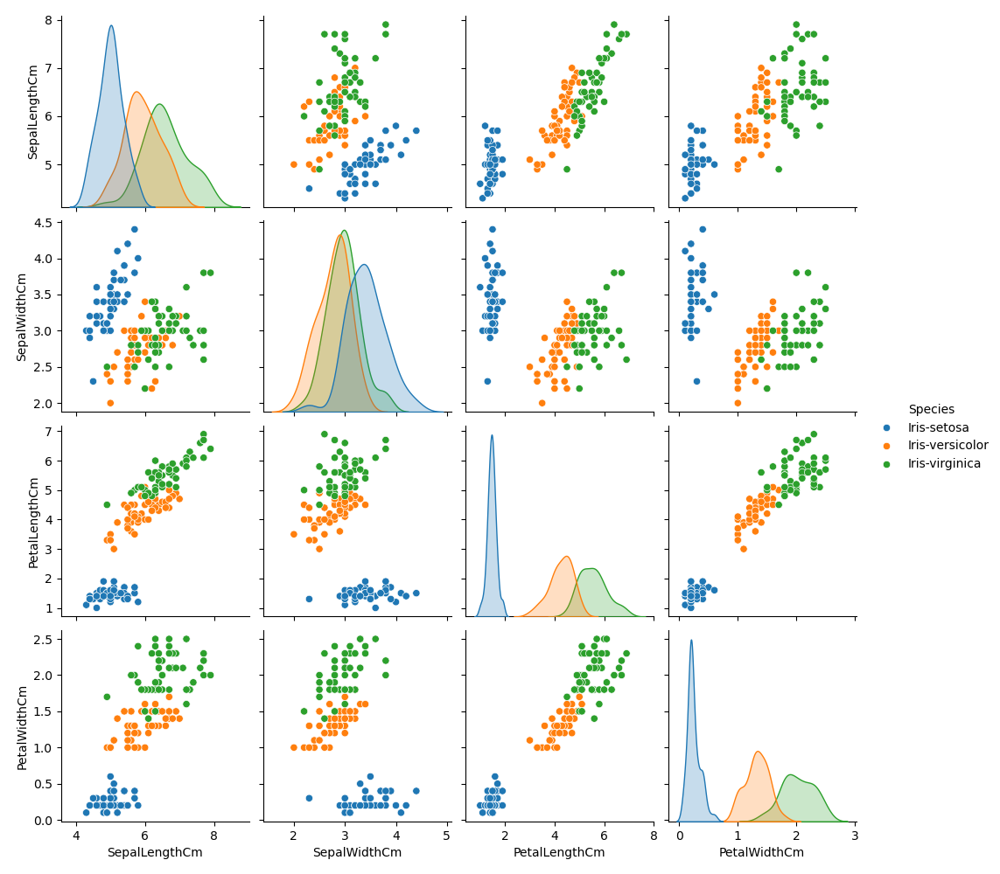

# 🌸 Iris Flower Classification

This is **Task 1** of my internship with **CodeAlpha – Data Science Track (July to September 2025)**.  
The goal of this project is to classify Iris flowers into three species using their physical measurements through a supervised machine learning model.

---

## 📌 Objective

- Use measurements of sepal and petal length/width to predict the flower species.
- Apply a classification model using scikit-learn.
- Evaluate its performance and visualize the feature relationships.

---

## 📊 Dataset

- **Source:** [Kaggle – Iris CSV Dataset](https://www.kaggle.com/datasets/saurabh00007/iriscsv)
- **Rows:** 150 samples
- **Features:**
  - SepalLengthCm
  - SepalWidthCm
  - PetalLengthCm
  - PetalWidthCm
- **Target:** Species (`Iris-setosa`, `Iris-versicolor`, `Iris-virginica`)

---

## ⚙️ Tools & Libraries Used

- Python 🐍
- Pandas
- Seaborn
- Matplotlib
- Scikit-learn (`RandomForestClassifier`, `train_test_split`, `metrics`)

---

## 🚀 Workflow

1. **Load and clean data** (removed `Id` column)
2. **Visualize** the relationships between features using pairplots
3. **Split** dataset into training and testing sets (80/20)
4. **Train** a `RandomForestClassifier` model
5. **Evaluate** performance using accuracy, confusion matrix, and classification report

---

## 📈 Model Evaluation

```
Accuracy: 1.0

Confusion Matrix:
 [[10  0  0]
  [ 0  9  0]
  [ 0  0 11]]

Classification Report:
                  precision    recall  f1-score   support

    Iris-setosa       1.00      1.00      1.00        10
Iris-versicolor       1.00      1.00      1.00         9
 Iris-virginica       1.00      1.00      1.00        11

       accuracy                           1.00        30
      macro avg       1.00      1.00      1.00        30
   weighted avg       1.00      1.00      1.00        30
```

---

## 📊 Visualization

Below is a **pairplot** showing the relationships between all numeric features, color-coded by species:



- `PetalLengthCm` and `PetalWidthCm` show the clearest separation between species.
- `Iris-setosa` is completely separable from the other two classes.
- Some overlap exists between `Iris-versicolor` and `Iris-virginica`.

---

## 💡 Insights & Conclusions

- Petal-based measurements (`PetalLengthCm` and `PetalWidthCm`) are the strongest predictors of Iris species.
- `Iris-setosa` is easily separable from the other two classes based on these features.
- The trained `RandomForestClassifier` achieved **100% accuracy**, indicating excellent model fit and well-separated classes.
- Confusion matrix confirms zero misclassifications.
- This task highlighted the importance of **exploratory data analysis (EDA)** and the power of **ensemble classifiers** in solving classification problems.

---

## 🧠 Why Random Forest Was Chosen

For this classification task, `RandomForestClassifier` was selected for the following reasons:

- **Supports Multiclass Classification:** Easily handles the three Iris species.
- **High Accuracy on Small Datasets:** Performs very well even with only 150 samples.
- **Low Risk of Overfitting:** Combines predictions from multiple decision trees, which increases stability and reduces variance.
- **No Need for Feature Scaling:** Works directly on the raw numerical data without preprocessing.
- **Handles Overlapping Features Well:** Effectively classifies even when some species (like Versicolor and Virginica) have similar measurements.
- **Provides Feature Importance:** Helps in identifying which features (e.g., PetalLengthCm) contribute most to prediction.

Overall, Random Forest was an ideal choice for this clean and structured dataset, and it achieved perfect classification accuracy.

---

## 🗂 Project Structure

```
CodeAlpha_Iris-Flower-Classification/
├── Iris.csv
├── iris_classifier.py
├── Pairplot_of_Iris_Dataset.png
└── README.md
```

---

## ✅ Outcome

- The model achieved **100% accuracy** on the test data.
- The dataset is ideal for beginners to practice classification and visualization.
- Successfully submitted as part of **CodeAlpha Internship Task 1**.

---

## 👩‍💻 Author

**Lamyaa Atef Hosney**  
Intern @ CodeAlpha | Data Science Track  
📅 Duration: July 25 – September 25, 2025  
📫 LinkedIn: [https://www.linkedin.com/in/lamyaa-atef]  
🔗 GitHub: [https://github.com/lamyaa-atef]

---

## 🏷️ Tags

`#CodeAlpha` `#DataScience` `#MachineLearning` `#Python` `#IrisDataset` `#RandomForest` `#Internship`


